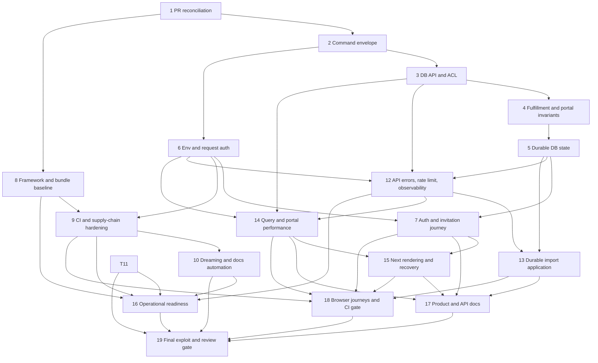

# Vercel Production-Readiness Remediation Blueprint

**Date:** 2026-08-31
**Branch:** `vercel-production-readiness`
**Worktree:** `/Users/tedslesinski/Repos/mgr2/.agents/worktrees/vercel-production-readiness`
**Audit source:** the confirmed SEC01–SEC16, OPS01–OPS12, DOC01–DOC13, and PERF01–PERF13 findings supplied for this remediation
**Scope:** implementation plan only; no production deployment, hosted provisioning, or schema application is authorized by this document

## 1. Goal and non-negotiable contracts

This work makes MGR safe to connect to Vercel and hosted Supabase without changing the product’s core interaction model: Next.js App Router pages and forms call the command registry; the command registry remains the single business-operation boundary; Supabase remains the source of tenant isolation and transactional truth.

The implementation must preserve these contracts:

1. **One baseline migration until first deployment.** All SQL changes stay in `supabase/migrations/00001_baseline.sql`. No second migration file may be created without explicit approval.
2. **No authenticated table DML.** `anon` and `authenticated` receive no direct `INSERT`, `UPDATE`, `DELETE`, or `TRUNCATE` on domain or internal tables. Every mutation goes through an allowlisted public RPC.
3. **Security-definer functions are narrow.** Every public write RPC uses `SECURITY DEFINER`, `SET search_path = ''`, `auth.uid()`-derived identity, explicit brewery/customer membership and role checks, canonical server-derived fields, and a request id. Internal helpers live in `private`; application roles cannot execute them.
4. **Idempotency is transactional.** A write request carries a UUID `requestId`. The same actor/request/payload replays the stored result. Reuse with a different brewery, command, or canonical payload is a conflict. The idempotency row and domain effects commit or roll back together.
5. **External Auth side effects are recoverable.** Invitation state is recorded in Postgres before Supabase Auth is called. Retry resumes a pending request; it never deletes or mutates a pre-existing Auth user as compensation.
6. **No raw internal errors cross the public boundary.** Clients receive stable error codes and safe messages. Correlation ids join API responses, structured logs, command executions, and operational runbooks.
7. **Modern environment names are the application contract.** The app consumes `NEXT_PUBLIC_SUPABASE_URL`, `NEXT_PUBLIC_SUPABASE_PUBLISHABLE_KEY`, `SUPABASE_SECRET_KEY`, and `COMMAND_RATE_LIMIT_HMAC_SECRET`. Local Supabase legacy values are mapped into those names by tooling rather than leaked into runtime code.
8. **Import is durable and bounded without a new dependency.** This plan selects an operator-driven, Postgres-backed import job. The browser parses with Papa Parse’s worker mode; upload and processing are bounded; every row has durable status and an idempotency key. No autonomous workflow product is introduced.
9. **No model authorizes its own writes.** ~~`--approve` is removed; apply actions require a detached SSH signature over a canonical request digest and a user-controlled allowed-signers file.~~ Satisfied by deletion instead (2026-09-02): `.agents/orchestration/` — the only thing that had a model-controlled approval flag — was removed unused, so no self-approval path exists to sign. See dropped Task 11.
10. **Measurement precedes bundle edits.** `next experimental-analyze` determines whether `lib/commands/all.ts` or `radix-ui` creates a client-bundle problem. No import rewrite is allowed without measured client inclusion.

## 2. Pre-execution reconciliation gate

The coordinator performs this gate before dispatching implementation work:

1. Verify `pwd`, `git branch --show-current`, and `git status --short --branch` in the specified worktree.
2. Fetch `origin` and rebase `vercel-production-readiness` on the then-current `origin/main` only if the worktree is clean.
3. Re-read PR #21 and PR #22 state.
   - If PR #22 is still open, preserve its two commits’ behavior: restore Mailpit to CI, allow `Skill` in the review workflow, remove `show_full_output`, and retain its README correction. Cherry-pick only when those commits are still absent from the rebased branch.
   - If PR #22 merged, do not cherry-pick it again.
   - Do not cherry-pick PR #21 wholesale. Task 10 supersedes it while retaining its useful invariant: GitHub Actions is a workflow-provided fact, not something the dreaming model should rediscover with shell commands.
4. Treat the dirty `documentation-agent`, `dreaming-fix`, and `http-api` worktrees as user-owned. Before touching an overlapping file, compare its branch diff and adapt; never copy or overwrite uncommitted work.
5. Record the base SHA and PR disposition in the implementation run log. If any of those branches merged after this plan was committed, update the task’s inputs before dispatch rather than applying duplicate fixes.

The user-reported failed main CI run `33461216933` is accepted as evidence: Mailpit exclusion caused `tests/commands-invites.test.ts` to fail. It must not be rerun merely to reconfirm the report.

**Plan-commit snapshot:** PR #22 merged as `fc20806` and PR #21 merged as `193b266`; this branch was rebased to that `origin/main`. Task 1 therefore treats their narrow fixes as upstream-satisfied and adds regression coverage rather than replaying either branch. Task 10 extends the merged PR #21 guard into the complete dreaming-state design.

## 3. Shared interfaces and database objects

These names are the cross-task contract. An agent may not rename or reshape them without the plan-mutation protocol in section 8.

### 3.1 TypeScript command contract

```ts
type OperationKind = "query" | "command";

type CommandExecution = {
  requestId: string;
  correlationId: string;
};

type PublicError = {
  code: string;
  message: string;
};

type CommandSuccess<T> = {
  ok: true;
  data: T;
  requestId?: string;
  correlationId: string;
};

type CommandFailure = {
  ok: false;
  error: PublicError;
  requestId?: string;
  correlationId: string;
};
```

`defineCommand` registers `kind: "command"` and a handler that receives `CommandExecution`. `defineQuery` registers `kind: "query"`; queries do not require a request id. `/api/command` rejects a missing or malformed write `requestId` before running the handler. The browser command client creates one UUID per user action and places it in the serialized request body so transport retries reuse it.

### 3.2 Database namespaces and ACL

- `extensions`: extension-owned objects, including `btree_gist` and `pgcrypto` when needed for SHA-256 hashing.
- `private`: command ledgers, import/invitation/rate-limit state, assertion helpers, numbering helpers, and other non-PostgREST internals.
- `public`: RLS-protected query tables/views and explicitly allowlisted RPC entry points only.

The baseline must explicitly revoke default privileges from `PUBLIC`, `anon`, and `authenticated`; then grant only the required schema usage, RLS-protected `SELECT`, and named RPC `EXECUTE`. `service_role` retains the explicit privileges required by `lib/supabase/admin.ts`. A post-reset test proves the effective privilege set instead of relying on source-text inspection.

### 3.3 Transactional idempotency

`private.command_requests` has the logical key `(actor_id, request_id)` and stores `brewery_id`, command name, canonical payload hash, state, stored JSON result, and timestamps. A private claim helper locks the row and returns either “execute” or the replay result. It raises a stable `MGR_REQUEST_CONFLICT` error when the same key is reused with a different brewery, command, or canonical payload. A completion helper records the result before commit.

Each public write RPC computes its own SHA-256 hash from canonical JSONB arguments. Callers never supply or select the hash. Concurrent identical requests serialize on the ledger row; the loser replays the winner’s result.

The external invitation saga is the sole ledger exception: its three database transactions share one workflow request id but use `private.invitation_requests`, not `private.command_requests`, for conflict detection, phase replay, and the evolving Auth user id. This avoids treating `prepare_invitation`, `mark_invitation_auth_created`, and `complete_invitation` as conflicting commands while preserving exact retry semantics.

Lock order is part of the contract: claim/lock the command-request row, claim the actor budget for a new write, then lock domain rows by stable primary-key order; record completion last. Credit operations lock invoice then credit rows; import claims rows by `row_no` with `FOR UPDATE SKIP LOCKED`; the route’s IP bucket is a separate pre-RPC transaction. Concurrency tests must exercise these orders under a short lock timeout.

### 3.4 Durable invitation state

`private.invitation_requests` has the logical key `(actor_id, request_id)` and stores brewery, canonical hash of the immutable invitation intent (email and requested role), Auth user id when known, `prepared | auth_created | completed | failed`, safe diagnostic code, and timestamps. Reuse with different immutable intent raises `MGR_REQUEST_CONFLICT`. Public idempotent RPCs `prepare_invitation`, `mark_invitation_auth_created`, and `complete_invitation` lock this row and either apply the next valid transition or return the already-reached state. The secret server client performs the Auth call after prepare, then persists the returned Auth user id with `mark_invitation_auth_created` before attempting completion. Retry uses the stored state and resolves an existing Auth user by paginating the Admin API only when the row has no saved Auth user id. Completion inserts membership and marks the request complete in one database transaction.

### 3.5 Durable import state

`private.import_jobs` records job ownership, brewery, kind, file digest, row/byte counts, state, progress counters, and timestamps. `private.import_rows` records `(job_id, row_no)`, deterministic row request id, normalized payload, status, safe outcome, lease owner/expiry, and timestamps. Public RPCs are `start_import`, `enqueue_import_rows`, `seal_import`, `process_import_batch`, and `get_import_job`.

Hard limits are part of the contract: 10 MiB file size, 5,000 data rows, 100 rows per enqueue call, 25 rows per processing call, and a 120-second processing lease. A logical row is atomic. Opening-balance inventory uses that row’s request id, so retry cannot duplicate stock.

### 3.6 Persistent command rate limits

`private.command_rate_buckets` stores fixed-window buckets keyed by actor/brewery/command and by HMAC-obscured IP/brewery/command. Every externally initiatable public write RPC calls `private.consume_actor_command_budget` after a new idempotency claim and before domain effects; the helper derives the actor from `auth.uid()`, validates membership, and selects a fixed server-owned policy by command name. Direct PostgREST RPC execution therefore cannot bypass the actor/tenant/command budget.

The command route applies an additional IP budget before invoking a write RPC. Query requests consume actor and IP budgets at the route because queries do not enter write RPCs. Initial policies are:

- queries: 120 actor requests/minute and 240 IP requests/minute;
- ordinary writes: 30 actor requests/minute and 60 IP requests/minute;
- import start/seal: 10 actor requests/minute and 20 IP requests/minute;
- import enqueue/process: 120 actor requests/minute and 240 IP requests/minute;
- invitation prepare: 5 actor requests/hour and 10 IP requests/hour;
- invitation continuation: 15 actor requests/hour and 30 IP requests/hour.

The route computes the IP token with HMAC-SHA-256 and `COMMAND_RATE_LIMIT_HMAC_SECRET`; raw addresses are not persisted or logged. On Vercel it trusts only the platform-owned `x-vercel-forwarded-for` value; it does not allow a caller-supplied `x-forwarded-for` value to choose a bucket. A caller can spend only the opaque IP bucket it names and cannot relax the non-bypassable actor budget. Local tests use an explicit development sentinel path.

## 4. Work-item ownership

A file may have only one active owner. Sequential tasks may transfer ownership after the prior task is merged into the shared branch and validated.

| Owner | Exclusive files while active |
|---|---|
| Coordinator | this plan, task integration, conflict resolution, final traceability, and shared truth docs: `README.md`, `public/docs/user-guide.html`, `.agents/ARCHITECTURE.md`, `.agents/MEMORY.md`, `.agents/PROGRESS.md` |
| Database boundary owner | `supabase/migrations/00001_baseline.sql`, database exploit/invariant tests, and the mutation command modules named in Tasks 3–5 |
| Auth/session owner | environment modules, Supabase clients, `proxy.ts`, auth routes/actions/pages, brewery/customer request context, invitation UI |
| Framework owner | `package.json`, `bun.lock`, `.node-version`, `.bun-version`, Vitest config, bundle evidence |
| Automation owner | `.github/workflows/*`, `.github/scripts/*`, `.agents/agents/dreaming.md`, `.github/agents/dreaming.md`, `.agents/DRIFT.md` |
| Command/API owner | registry, command route/client/form hook, public errors, rate policy, observability, health route |
| Import owner | import command application layer and import UI after Task 5 transfers those files |
| Query/UI owner | read queries, customer/order/portal pages, cart helper |
| Next rendering owner | layouts, `loading.tsx`, error boundaries, not-found handling |
| Operations/docs owner | new operational runbooks and canonical API documentation after the Command/API owner transfers it |
| E2E owner | `tests-e2e/*` and the CI E2E job after workflow ownership transfers from Task 9 |

Whenever a task names a shared truth doc, its specialist supplies the exact documentation delta but does not edit that file. The coordinator applies those deltas serially before the task’s logical commit, so behavior and documentation still land together without parallel file collisions.

## 5. Execution DAG and review gates



**Wave 0:** Task 1, then Task 2.
**Wave 1:** one sequential database lane (Tasks 3 → 4 → 5), one auth foundation lane (Task 6, then Task 7 after Task 5), and one framework lane (Task 8) may run concurrently. The automation lane starts Task 9 only after Tasks 6 and 8; Tasks 10 and 11 may then run concurrently because shared truth-doc edits are coordinator-serialized. At most six specialists run concurrently.
**Wave 1 review gate:** database, security, and performance reviewers must approve the Data API boundary, idempotency semantics, and request-auth/environment contracts before Wave 2.
**Wave 2:** Task 12, then Tasks 13 and 14 in parallel; Task 15 follows Task 14. Shared `public/docs/user-guide.html` deltas from Tasks 13 and 14 are applied serially by the coordinator before their separate commits.
**Wave 2 review gate:** database, security, performance, and accessibility reviewers approve the end-to-end application paths.
**Wave 3:** Tasks 16, 17, and 18 may run by code ownership, while coordinator-owned README/current-state edits are integrated serially; then Task 19. Stop for a checkpoint after each wave because each wave can be multi-hour.

## 6. Numbered implementation tasks

### Task 1 — Reconcile active PR fixes and restore a reproducible baseline

- **Findings:** OPS10, OPS11; overlap with PR #22 and PR #21.
- **Regression test first:** create `tests/workflow-contract.test.ts` asserting that CI does not exclude `tests/commands-invites.test.ts`, the review action permits `Skill`, `show_full_output` is absent, and the dreaming prompt treats GitHub Actions as trusted workflow context. These behaviors are already present via merged PRs #22/#21, so do not manufacture a red state; the new test prevents regression and becomes Task 9’s workflow-test foundation.
- **Modify:** add `tests/workflow-contract.test.ts`. Touch `.github/workflows/ci.yml`, `.github/workflows/claude-code-review.yml`, or README only if the pre-execution rebase shows an upstream regression.
- **Types/interfaces:** no production TypeScript interface changes.
- **Steps:** rerun the pre-execution reconciliation gate, record merged SHAs, and run the contract and invite tests with local Mailpit available.
- **Acceptance:** `npx vitest run tests/workflow-contract.test.ts tests/commands-invites.test.ts`; `npx tsc --noEmit`; branch and worktree remain correct and clean after commit.
- **Depends on:** none.
- **Commit boundary:** `test(ci): preserve merged readiness fixes`.
- **Rollback:** revert this commit; no database state is involved.

### Task 2 — Establish command/query execution metadata and request envelopes

- **Findings:** SEC07 foundation; enables SEC13–SEC15 and OPS09.
- **Test first:** extend `tests/registry.test.ts` and create `tests/api-command.test.ts` to prove that definitions retain `query` versus `command`, write requests reject missing/non-UUID request ids, queries do not require one, and correlation ids are present but independent from request ids.
- **Modify:** `lib/commands/registry.ts`, `lib/commands/client.ts`, `lib/commands/use-command-form.ts`, `app/api/command/route.ts`, `tests/registry.test.ts`, `tests/api-command.test.ts`.
- **Types/interfaces:** add `OperationKind`, `CommandExecution`, typed definition kinds, and the request/success/failure envelopes from section 3.1. `CommandError` gains a stable `code`, but raw-error sanitization lands in Task 12.
- **Steps:** split `defineQuery` from the current alias; expose a definition lookup that does not execute a command; create one request id per browser action; validate command names and request ids before handler execution; preserve current response semantics temporarily behind the new typed envelope so Task 12 can complete the clean cutover.
- **Acceptance:** red tests become green; every existing registry module type-checks without an alias or compatibility shim; `npx vitest run tests/registry.test.ts tests/api-command.test.ts`; `npx tsc --noEmit`.
- **Depends on:** Task 1.
- **Commit boundary:** `refactor(commands): distinguish writes and carry execution metadata`.
- **Rollback:** revert the commit; later tasks cannot proceed without this interface.

### Task 3 — Replace table DML with an explicit, idempotent database API

- **Findings:** SEC01, SEC02, SEC03, SEC07, SEC12, SEC16.
- **Test first:** create `tests/data-api-boundary.test.ts`, `tests/command-idempotency.test.ts`, and `tests/commands-catalog.test.ts`. Against a reset database, prove that authenticated direct insert/update/delete fails, unauthorized RPC calls fail, same-request replay returns the original result, payload mismatch conflicts, concurrent replay produces one domain effect, and private helpers are not executable.
- **Modify:** `supabase/migrations/00001_baseline.sql`, `lib/commands/catalog.ts`, `lib/commands/customers.ts`, `lib/commands/inventory.ts`, `lib/commands/import.ts`, `lib/commands/orders.ts`, `lib/commands/portal.ts`, `tests/commands-customers.test.ts`, `tests/commands-inventory.test.ts`, `tests/commands-import.test.ts`, `tests/commands-orders.test.ts`, `tests/commands-portal.test.ts`; add the three named test files. The coordinator applies the `.agents/ARCHITECTURE.md` and `.agents/MEMORY.md` deltas before commit.
- **SQL:** create `extensions` and `private`; install/relocate `btree_gist` and `pgcrypto` in `extensions`; create `private.command_requests`, private membership/role assertion helpers, and private claim/complete helpers. Add or harden public write RPCs `create_product`, `create_sku`, `create_location`, `upsert_customer`, `upsert_ship_to`, `upsert_price_list`, `set_price`, `record_inventory_movement`, and `set_taproom_par`. Add `p_request_id uuid` and command-ledger handling to every existing order, invoice, allocation, replenishment, and portal write RPC without changing Task 4’s domain invariants yet. Every RPC derives identity/tenant/role internally, computes a canonical payload hash, and records its result transactionally.
- **ACL:** after every mutation caller is converted in this same task, revoke schema/table/function defaults from `PUBLIC`, `anon`, and `authenticated`; grant exact RLS-protected reads and named RPC execution; preserve explicit `service_role` access. Move `next_no` and numbering helpers to `private`; trigger execution must not expose arbitrary numbering to application roles.
- **Types/interfaces:** every write handler in the named modules consumes `CommandExecution.requestId` and calls an RPC rather than direct table DML. Import rows temporarily derive deterministic child UUIDs from the top-level request id so the branch remains green until Task 13 replaces the in-memory workflow.
- **Acceptance:** `npx supabase db reset`; the new exploit suites pass using real `anon`, `authenticated`, and admin clients; every catalog/customer/inventory/import/order/portal mutation suite passes after the global revoke; same-request replay works for at least one mutation in each module; a direct Data API exploit is denied; `npx tsc --noEmit`; `npm run lint`.
- **Depends on:** Task 2.
- **Commit boundary:** `security(db): expose only idempotent mutation RPCs`.
- **Rollback:** revert code and baseline together, then `supabase db reset`; never roll back only the ACL or only the callers.

### Task 4 — Make fulfillment, credit, and portal mutations exact

- **Findings:** SEC08, SEC09, SEC10, SEC11.
- **Test first:** extend `tests/commands-orders.test.ts` and `tests/commands-portal.test.ts`; create `tests/commands-invoices.test.ts`. Cover unknown-line, foreign-line, duplicate-line, over-shipment, concurrent-credit, cross-customer-price, and direct-order-line-edit exploits.
- **Modify:** `supabase/migrations/00001_baseline.sql`, `lib/commands/orders.ts`, `lib/commands/portal.ts`, `tests/commands-orders.test.ts`, `tests/commands-portal.test.ts`; add `tests/commands-invoices.test.ts`. The coordinator applies architecture/memory deltas before commit.
- **SQL:** harden `record_pick` and `ship_order` so the submitted line-id set exactly equals the order’s line-id set, has no duplicates, and every quantity is in range; enforce shipped ≤ picked and order status transitions under row locks. Lock the invoice/credit facts needed by `create_credit_memo` before calculating remaining refundable value. Remove customer direct DML on `orders` and `order_lines`; portal writes remain narrow RPCs that derive customer, price, brewery, status, and audit fields. Preserve Task 3’s request-id and command-ledger wrappers.
- **Types/interfaces:** Zod schemas reject duplicate submitted line ids before the RPC; portal catalog and order handlers accept the selected customer only through trusted context.
- **Acceptance:** exploit tests demonstrate no partial pick/ship side effects, no duplicate shipment side effects, no over-credit under concurrent requests, and no customer price/order-line tampering; existing order/invoice/portal suites pass after `supabase db reset`; `npx tsc --noEmit`; `npm run lint`.
- **Depends on:** Task 3.
- **Commit boundary:** `security(db): make fulfillment and portal transitions exact`.
- **Rollback:** revert code and baseline together, reset the local database, and rerun the prior boundary suite.

### Task 5 — Add durable invitation, import, and rate-limit state

- **Findings:** SEC05, SEC15, OPS01; enables PERF08.
- **Test first:** create `tests/invitation-state.test.ts`, `tests/import-durability.test.ts`, and `tests/command-rate-limit.test.ts`. Prove `prepared → auth_created → completed` transitions, interruption after durable `auth_created`, lease expiry/recovery, row replay, import ceilings, direct-RPC actor-budget exhaustion, IP-bucket exhaustion, and concurrency against real Postgres.
- **Modify:** `supabase/migrations/00001_baseline.sql` and the three named tests. The coordinator applies architecture/memory deltas before commit.
- **SQL:** add `private.invitation_requests`, `private.import_jobs`, `private.import_rows`, and `private.command_rate_buckets`; add `prepare_invitation`, `mark_invitation_auth_created`, `complete_invitation`, the import RPCs, and rate helpers described in sections 3.4–3.6. Invitation transitions use the invitation row as their phase/idempotency ledger and never claim conflicting `command_requests` rows; all other public mutations retain Task 3’s command ledger. Inject the fixed-policy actor-budget claim into every externally initiatable public write RPC from Tasks 3–4. All functions retain the same role, tenant, empty-search-path, and explicit-grant rules.
- **Types/interfaces:** database result shapes are fixed for downstream tasks: invitation `{state, authUserId?, membershipId?}`, import job `{id,state,totalRows,processedRows,succeededRows,failedRows}`, process result `{claimed,processed,succeeded,failed,done}`, and rate result `{allowed,remaining,retryAfterSeconds}`.
- **Acceptance:** `auth_created` survives a deliberately skipped/failed completion and retry completes one membership; expired import leases are reclaimable; duplicate row request ids create one domain effect; size/row ceilings fail before rows are accepted; a direct authenticated write RPC cannot bypass its actor/brewery/command budget; IP buckets persist across clients; `npx supabase db reset`; all database and mutation suites pass.
- **Depends on:** Task 4.
- **Commit boundary:** `feat(db): add durable workflow and rate-limit state`.
- **Rollback:** revert the baseline and tests together and reset local Supabase; no hosted migration is authorized.

### Task 6 — Validate environment configuration and share request-scoped auth work

- **Findings:** SEC06, SEC14, OPS03, OPS04, PERF01.
- **Test first:** create `tests/env.test.ts`, `tests/request-auth.test.ts`, and `tests/proxy.test.ts`. Prove fail-fast missing/invalid variables, no secret import from client code, cache/security headers survive Supabase cookie refresh, auth failures remain distinct from membership denials, and a composed staff request reuses one real Auth identity lookup and one membership lookup.
- **Create:** `.env.example`, `lib/env/public.ts`, `lib/env/server.ts`, `lib/auth/request-context.ts`, `scripts/supabase-env.mjs`.
- **Modify:** `lib/supabase/server.ts`, `lib/supabase/admin.ts`, `lib/supabase/client.ts`, `lib/commands/context.ts`, `lib/brewery.ts`, `lib/portal.ts`, `proxy.ts`, `app/(auth)/actions.ts`, `tests/helpers.ts`, `.github/workflows/ci.yml`, `tests/workflow-contract.test.ts`. The coordinator applies README changes before commit.
- **Types/interfaces:** `PublicEnv`, `ServerEnv`, `RequestIdentity`, `StaffMembership`, and `CustomerMembership`. `getRequestIdentity()` uses `auth.getClaims()` for request authentication; cached membership resolvers are shared by app layout, portal layout, and command context. Bearer-token context remains explicit and separate.
- **Environment contract:** consume only `NEXT_PUBLIC_SUPABASE_URL`, `NEXT_PUBLIC_SUPABASE_PUBLISHABLE_KEY`, `SUPABASE_SECRET_KEY`, and `COMMAND_RATE_LIMIT_HMAC_SECRET`; validate optional `VERCEL_ENV` as `production | preview | development`. The local mapping script converts Supabase CLI `ANON_KEY`/`SERVICE_ROLE_KEY` output into the modern names; app code has no legacy fallback.
- **Proxy contract:** implement the current `@supabase/ssr` `setAll(cookies, headers)` signature; preserve all returned `Cache-Control`, `Expires`, and `Pragma` headers when rebuilding a response; do not perform a second `getUser()` call.
- **Acceptance:** new tests pass with real local Supabase responses and a counting fetch wrapper that delegates to the real endpoints; `npm run build` proves the secret module is not client-importable; direct `process.env` runtime reads outside env modules are eliminated; CI maps Supabase CLI output to the modern names in the same commit as the app cutover; `npx vitest run tests/env.test.ts tests/request-auth.test.ts tests/proxy.test.ts tests/workflow-contract.test.ts`; `npx tsc --noEmit`; `npm run lint`.
- **Depends on:** Task 2. May run in parallel with Tasks 3–5, but Task 7 waits for both lanes.
- **Commit boundary:** `security(auth): validate env and cache request identity`.
- **Rollback:** revert the commit and restore the prior local env file from the operator’s untracked copy; never commit secrets.

### Task 7 — Complete callback, password recovery, and durable invitation journeys

- **Findings:** SEC04, SEC05, PERF09.
- **Test first:** create `tests/auth-flow.test.ts`, `tests/invite-workflow.test.ts`, and `tests-e2e/auth-invitation.ts`. Use real local Supabase Auth/Admin APIs and Mailpit to prove code exchange, token-hash invite confirmation, safe `next` validation, password reset, durable `auth_created`, interruption before completion, successful invitation retry, and one membership.
- **Create:** `app/(auth)/auth/callback/route.ts`, `app/(auth)/forgot-password/page.tsx`, `app/(auth)/update-password/page.tsx`, `app/(auth)/password-actions.ts`, `tests-e2e/auth-invitation.ts`.
- **Modify:** `app/(auth)/actions.ts`, `app/(app)/settings/team/invite-form.tsx`, `lib/commands/invites.ts`, `tests/commands-invites.test.ts`, `tests/auth-flow.test.ts`, `tests/invite-workflow.test.ts`. The coordinator applies the user-guide delta before commit.
- **Types/interfaces:** `AuthRedirectType`, `InvitationRequestState`, and safe action-state error codes. Login uses the user returned by `signInWithPassword` rather than a second user fetch. Callback supports PKCE `code` and `token_hash`/OTP invite-recovery links. `next` must begin with one `/`, never `//`, and must remain same-origin.
- **Invitation algorithm:** use the browser’s one workflow `requestId` for all three invitation transitions. Call `prepare_invitation` before Auth; call `mark_invitation_auth_created` immediately after Auth returns a user id; on retry, inspect the returned phase, skip Auth if that id is known or paginate Admin users to resolve the prepared email, and call `complete_invitation`. The invitation ledger—not `command_requests`—makes each phase replay-safe and detects immutable-intent mismatch. Preserve `auth_created` after a completion failure. Never compensate by deleting an existing user; recovery is the safe compensation for newly created users as well.
- **UI gate:** keep the invitation submit action disabled in the intermediate red state; enable it in the same commit only after the real Auth interruption/retry test passes.
- **Acceptance:** targeted Auth/invite tests and `tests-e2e/auth-invitation.ts` pass against Mailpit and a real browser; the invite link reaches callback/update-password, login performs one Auth identity operation, and user-facing errors are safe; `npx tsc --noEmit`; `npm run lint`.
- **Depends on:** Tasks 5 and 6.
- **Commit boundary:** `feat(auth): complete recovery and resumable invitations`.
- **Rollback:** revert UI, actions, route, command, and docs together; prepared request rows are safe to retain locally.

### Task 8 — Pin the runtime, patch Next.js, remove the Vitest warning, and measure bundles

- **Findings:** OPS05, PERF11, PERF12, PERF13.
- **Test/reproduction first:** capture the existing Vitest CommonJS warning and the pre-change `next experimental-analyze` route/module report. Extend `tests/tooling-contract.test.ts` to assert the Node engine, exact framework versions, and ESM Vitest config path.
- **Create:** `.node-version`, `tests/tooling-contract.test.ts`, `docs/operations/performance-baseline.md`.
- **Rename:** `vitest.config.ts` to `vitest.config.mts` using language-server file rename if references exist.
- **Modify:** `package.json`, `bun.lock`, `next.config.ts` only if the installed Next documentation requires a patch-compatible option change.
- **Runtime contract:** Node `22.x`; Next.js and `eslint-config-next` exactly `16.3.4`; preserve React versions unless the official Next 16.3.4 peer contract requires an aligned patch. No dependency is added.
- **Measurement rule:** use the installed Next 16 analyzer before touching imports. If `lib/commands/all.ts` is absent from client chunks and `radix-ui` tree-shakes to used primitives, record the evidence and make no code change. If the entire Radix barrel is present, change only measured client components to supported `radix-ui/<primitive>` exports and browser-check them. If command registration enters a client chunk, move only the server side-effect import to the server entry. A dependency change requires approval.
- **Acceptance:** `npx vitest run tests/tooling-contract.test.ts` emits no Vite CJS warning; `npx tsc --noEmit`; `npm run lint`; `npm run build`; analyzer evidence names the inspected routes/modules and the no-change/change decision.
- **Depends on:** Task 1. May run beside database and auth foundation lanes.
- **Commit boundary:** `chore(runtime): pin Node and Next production baseline`.
- **Rollback:** revert package/config/evidence together and run `bun install`; do not hand-edit the lockfile.

### Task 9 — Harden CI inputs, action/plugin provenance, and build parity

- **Findings:** OPS10, OPS11, OPS12.
- **Test first:** extend `tests/workflow-contract.test.ts` so every existing workflow `uses:` entry must end in a full commit SHA; CI must preserve Task 6’s modern Supabase mapping and Mailpit, run the repository’s exact validation scripts, and build under Node 22. Add a fixture proving a mutable action tag and an unpinned plugin checkout are rejected.
- **Modify:** `.github/workflows/ci.yml`, `.github/workflows/claude-code-review.yml`, `.github/workflows/claude.yml`, `.github/workflows/documentation-agent.yml`, `.github/workflows/dreaming.yml`, `tests/workflow-contract.test.ts`.
- **Pinned SHAs:** preserve action major behavior while pinning known commits: checkout v4 `11d5960a326750d5838078e36cf38b85af677262` where currently v4, checkout v6 `d23441a48e516b6c34aea4fa41551a30e30af803` where currently v6, setup-node v4 `49933ea5288caeca8642d1e84afbd3f7d6820020`, Supabase CLI action `ab058987d8d6c725971f6cf9d0b5c98467e30bd1`, Claude Code action `833fb0f8c9f6686b33d963a8bae0a94f4936ab2a`, and github-script v7 `f28e40c7f34bde8b3046d885e986cb6290c5673b`.
- **Plugin contract:** checkout `anthropics/claude-code` at `f275fa282e76c5e5456912268f2c367a7f4f4797` into `.claude-code-src`, then pass `--plugin-dir $GITHUB_WORKSPACE/.claude-code-src/plugins/code-review` through the pinned action’s `claude_args`. The Claude CLI’s supported `--plugin-dir` flag avoids marketplace resolution entirely; remove `plugin_marketplaces` and `plugins` inputs rather than falling back to an unpinned Git URL.
- **Acceptance:** workflow source tests pass; local equivalents `npx supabase start`, `npx supabase db reset`, `npx vitest run`, `npx tsc --noEmit`, `npm run lint`, and `npm run build` pass under Node 22. Task 18 adds the final browser job before release.
- **Depends on:** Tasks 1, 6, and 8.
- **Commit boundary:** `ci: pin workflow supply chain and runtime parity`.
- **Rollback:** revert workflows and tests together; no hosted setting is changed.

### Task 10 — Separate interactive agents and make docs/dreaming recovery deterministic

- **Findings:** DOC06, DOC07, DOC09, DOC10, DOC11, DOC12; supersedes PR #21.
- **Test first:** create `tests/agent-automation.test.ts` for dreaming and retain `tests/documentation-agent.test.ts` for the customer guide. Prove that the interactive agent directory cannot see the CI dreaming prompt, the workflow uses the primary `refs/dreaming/last-checked` base, flag-only drift creates a tracked diff, and the documentation workflow accepts only a self-contained `public/docs/user-guide.html` diff.
- **Create:** `.github/agents/dreaming.md`, `.agents/DRIFT.md` with a module-level purpose comment/heading.
- **Move/remove:** move CI-only content out of `.agents/agents/dreaming.md`; remove the old interactive projection rather than leaving an alias.
- **Modify:** `.github/workflows/dreaming.yml`, `.github/workflows/documentation-agent.yml`, `.agents/agents/documentation-maintainer.md`, `public/docs/user-guide.html`, `tests/agent-automation.test.ts`, `tests/documentation-agent.test.ts`, `AGENTS.md`. The coordinator applies the architecture delta before commit.
- **Dreaming contract:** the workflow calculates one base SHA from `refs/dreaming/last-checked`, injects it as trusted context, and advances the marker only after successful push/PR handling. Flag-only results update `.agents/DRIFT.md`, ensuring a commit and PR exist. Preserve PR #21’s useful CI-context statement without its divergent last-`dream:` base logic.
- **Docs-agent contract:** after each merge, the read-only GitHub job audits every current user-facing route and may edit only the self-contained customer field manual. A separate deterministic job rejects wider or active-content changes and maintains one reviewable documentation branch and pull request; the model never commits to `main` or receives a write-capable GitHub token.
- **Acceptance:** the guide covers every current staff and portal surface; the model edit allowlist and deterministic single-file validator are pinned by tests; last-checked and flag-only tests pass; workflow contract tests pass; `npx tsc --noEmit`; `npm run lint`.
- **Depends on:** Task 9.
- **Commit boundary:** `security(agents): isolate prompts and persist recovery state`.
- **Rollback:** revert workflow, prompt move, ledger, customer guide, tests, and docs together; do not advance any real marker during local validation.

### Task 11 — ~~Replace model-controlled approval with signed external authorization~~ (dropped 2026-09-02)

**Obsolete: the subject of this task no longer exists.** `.agents/orchestration/`
was deleted after going from PR #8 to 2026-09-02 without producing a single run
— `runs/` was empty for its whole life. DOC08's finding was that the harness's
`--approve` flag let a model authorize its own high-risk implementation;
deleting the harness removes that approval path entirely, which closes the
finding more completely than signing it would have.

Nothing replaces this task. If cross-provider orchestration is ever rebuilt,
the signed-authorization design is recoverable from this file's history and
should be a precondition of that work rather than a follow-up to it.

### Task 12 — Sanitize public errors, enforce rate limits, and add structured observability

- **Findings:** SEC13, SEC14, SEC15, OPS09; completes SEC07’s API contract.
- **Test first:** extend `tests/api-command.test.ts` and create `tests/command-errors.test.ts`, `tests/command-rate-route.test.ts`, and `tests/observability.test.ts`. Prove that unknown Postgres details are absent, known `MGR_*` business errors map to stable codes/messages/statuses, every response and log shares a correlation id, write replays preserve request id/result, direct RPCs cannot bypass actor budgets, route actor/IP budgets return `429` with `Retry-After`, spoofed `x-forwarded-for` cannot choose a Vercel bucket, and logs omit payloads, tokens, email addresses, and raw IPs.
- **Create:** `lib/commands/errors.ts`, `lib/commands/rate-policy.ts`, `lib/observability/log.ts`, `app/api/health/route.ts`, `docs/api/command.md` with one canonical marker pair and a purpose statement.
- **Modify:** `lib/commands/registry.ts`, `lib/commands/context.ts`, `app/api/command/route.ts`, `lib/commands/client.ts`, `tests/api-command.test.ts`, `tests/command-errors.test.ts`, `tests/command-rate-route.test.ts`, `tests/observability.test.ts`.
- **Rate-limit contract:** for writes, the route consumes the HMAC-IP budget and each RPC independently consumes its non-bypassable actor/brewery/command budget. For queries, the route consumes both actor and IP budgets. Neither route input nor a direct PostgREST caller can choose limits or relax policy.
- **Error contract:** `CommandError(code, message, status)` is only for controlled public errors. Map stable database tokens to safe errors. Unknown Supabase/Postgres/Auth failures become `INTERNAL_ERROR`; retain structured internal metadata only in server logs.
- **Observability/runtime contract:** JSON logs include timestamp, event, correlation id, request id when present, command, actor id, brewery id, latency, outcome, and stable error code. They exclude request input and direct PII. The command and health routes explicitly use the Node.js runtime. Health is a no-secret liveness check; authenticated command canaries remain documented operational checks rather than a privileged public health endpoint.
- **Acceptance:** all error/rate/observability tests pass with real rate buckets; responses use the final `CommandSuccess | CommandFailure` shape and `x-correlation-id`; no raw `error.message` is returned from the command route; `npx tsc --noEmit`; `npm run lint`.
- **Depends on:** Tasks 3, 5, and 6.
- **Commit boundary:** `security(api): sanitize failures and enforce persistent budgets`.
- **Rollback:** revert route/core/health/docs together; database rate tables can remain inert locally.

### Task 13 — Replace in-memory CSV execution with a durable bounded import job

- **Findings:** OPS01, PERF08.
- **Test first:** extend `tests/import-durability.test.ts` and `tests/commands-import.test.ts`; create `tests/import-client.test.ts` and `tests-e2e/import-resume.ts`. Prove preflight byte/row rejection before mutation, deterministic file and row ids, 100-row upload batches, 25-row processing batches, resumability after interruption/lease expiry, one outcome per row, and no duplicate opening-balance movement after replay.
- **Create:** `lib/import/limits.ts`, `lib/import/row-id.ts`, and `tests-e2e/import-resume.ts` with module-level purpose comments.
- **Modify:** `lib/commands/import.ts`, `app/(app)/settings/import/import-client.tsx`, `tests/import-durability.test.ts`, `tests/commands-import.test.ts`, `tests/import-client.test.ts`. The coordinator applies the user-guide delta before commit.
- **Types/interfaces:** `ImportKind`, `ImportJob`, `ImportRowEnvelope`, `ImportProgress`, `ImportOutcome`. Commands become `start_import`, `enqueue_import_rows`, `seal_import`, `process_import_batch`, and `get_import_job`; remove the old monolithic `import_csv` path and its temporary child-id helper in a clean cutover.
- **Browser behavior:** dynamically import Papa Parse only when a file is selected. First worker pass: validate/count with chunk callbacks, compute the bounded 10 MiB file digest, retain no rows, and perform no mutation. Only after that pass proves the row ceiling does a second worker pass stream 100-row chunks to durable enqueue calls without whole-file aggregation. After sealing, run at most four 25-row processing calls concurrently and at most 200 calls for the 5,000-row ceiling; reload/revisit resumes the same job.
- **Acceptance:** interruption/retry tests and `tests-e2e/import-resume.ts` pass against real Postgres and a real browser; over-limit files create no job/row/domain mutation; the browser never holds all normalized rows; opening balances remain exactly-once; measured app chunks exclude Papa until the import screen activates it; `npx tsc --noEmit`; `npm run lint`.
- **Depends on:** Tasks 5 and 12.
- **Commit boundary:** `feat(import): make CSV processing durable and bounded`.
- **Rollback:** revert app/command/docs together; local incomplete jobs remain inspectable and can be reset with the local database.

### Task 14 — Bound and parallelize customer, order, invoice, and portal reads

- **Findings:** SEC11, PERF02, PERF03, PERF07, PERF10.
- **Test first:** extend `tests/commands-customers.test.ts`, `tests/commands-orders.test.ts`, `tests/commands-invoices.test.ts`, and `tests/commands-portal.test.ts`; create `tests/portal-cart.test.ts` and `tests-e2e/app-journeys.ts`. Prove one customer-list call supplies ship-to data, missing details return `null`, independent reads are concurrent, portal prices are scoped to the selected customer, list inputs enforce bounds, cart aggregation is linear, and the affected CRUD/portal browser journeys exercise the real surface.
- **Create:** `lib/portal/cart.ts` and `tests-e2e/app-journeys.ts` with module-level purpose comments.
- **Modify:** `lib/commands/customers.ts`, `lib/commands/orders.ts`, `lib/commands/portal.ts`, `app/(app)/orders/page.tsx`, `app/(portal)/portal/cart.tsx`, `tests/commands-customers.test.ts`, `tests/commands-orders.test.ts`, `tests/commands-invoices.test.ts`, `tests/commands-portal.test.ts`, `tests/portal-cart.test.ts`. The coordinator applies the user-guide delta before commit.
- **Interfaces:** `list_customers` returns the ship-to summary required by the order page; remove per-customer `get_customer` calls. `get_customer`, `get_order`, and `get_invoice` return `null` when the root row is absent and use `Promise.all` only for independent child reads. Portal list inputs use validated `limit` and `offset`, with defaults and hard maxima; selects include only rendered columns.
- **Portal scope:** resolve exactly one active customer context and exactly that customer’s applicable price list. No “all RLS-visible price lists” query is permitted.
- **Cart:** build a `Map` once and reduce quantities in O(n); preserve current totals and serialization.
- **Acceptance:** query tests and the CRUD/portal portions of `tests-e2e/app-journeys.ts` pass in a real browser; instrumented real requests show no customer N+1 and concurrent detail reads; portal cross-customer prices fail closed; list responses stay within maxima; `npx tsc --noEmit`; `npm run lint`.
- **Depends on:** Tasks 3, 6, and 12. May run in parallel with Task 13.
- **Commit boundary:** `perf(queries): bound portal reads and remove request waterfalls`.
- **Rollback:** revert query/page/cart/docs together; no schema rollback is required.

### Task 15 — Add route recovery, not-found semantics, and streaming fallbacks

- **Findings:** PERF04, PERF05, PERF06; completes PERF01 and PERF09 at the rendered surface.
- **Test first:** create `tests/detail-not-found.test.ts` and extend the existing `tests-e2e/app-journeys.ts` with failing loading, not-found, and retry expectations before implementation.
- **Create:** `app/error.tsx`, `app/global-error.tsx`, `app/not-found.tsx`, `app/(app)/loading.tsx`, `app/(portal)/loading.tsx`, `app/(app)/orders/[id]/loading.tsx`, `app/(app)/customers/[id]/loading.tsx`, `app/(app)/invoices/[id]/loading.tsx`, `app/(portal)/portal/orders/[id]/loading.tsx`.
- **Modify:** `app/(app)/layout.tsx`, `app/(portal)/layout.tsx`, `app/(app)/error.tsx`, `app/(portal)/error.tsx`, `app/(app)/orders/[id]/page.tsx`, `app/(app)/customers/[id]/page.tsx`, `app/(app)/invoices/[id]/page.tsx`, `app/(portal)/portal/orders/[id]/page.tsx`, `tests-e2e/app-journeys.ts`, and stale raw-error comments/docs in those files.
- **Next.js contract:** follow the installed `node_modules/next/dist/docs/` guides for error, global-error, not-found, loading, and streaming. Wrap the authenticated async shell inside each route-group layout with `<Suspense>` so `loading.tsx` can render; do not assume a segment’s `error.tsx` catches its own layout. Error components show safe messages and use `retry()`; they never render raw `error.message`. Detail pages call `notFound()` when Task 14 loaders return `null`.
- **Accessibility:** loading and error states use semantic status/alert behavior, visible keyboard-operable retry controls, preserved focus, and no focus trap. Global error includes `<html>` and `<body>` as required by Next.
- **Acceptance:** type/tests pass; a real browser observes loading UI under throttled data, safe retry behavior, and branded 404s at each named detail route; no raw internal error is visible; `npm run build`; `npx tsc --noEmit`; `npm run lint`.
- **Depends on:** Tasks 7 and 14.
- **Commit boundary:** `feat(ui): add safe route recovery and streaming states`.
- **Rollback:** revert route files and loader call-site changes together; no database state is involved.

### Task 16 — Define preview/production operations, rollback, restore, and incident response

- **Findings:** OPS02, OPS06, OPS07, OPS08, OPS09.
- **Test first:** create `tests/operations-docs.test.ts` that verifies required runbook sections, exact environment names, separate Preview/Production projects, region co-location decision, migration/rollback responsibilities, restore-drill evidence fields, canary commands, alert owners, retention, and incident severity/rollback triggers.
- **Create:** `docs/operations/deployment.md`, `docs/operations/supabase-auth.md`, `docs/operations/database-recovery.md`, `docs/operations/observability.md`, `docs/operations/incident-response.md`, each with a purpose statement.
- **Modify:** `tests/operations-docs.test.ts`; the coordinator applies the README delta before commit. Add `vercel.json` only if an exact Vercel region can be selected from an actually provisioned Supabase project; do not guess a region before provisioning.
- **Deployment contract:** document separate hosted Supabase projects for Vercel Preview and Production; environment-scoped keys; Node 22; production branch; Git integration; required CI checks; immutable action/plugin refs; Auth site URL/redirect allowlist/SMTP/rate-limit checklist; selecting the Vercel Functions region that matches the selected Supabase region.
- **Database recovery:** document pre-migration backup and restore verification, forward-fix-first policy for non-backward-compatible schema changes, PITR/tier selection before launch, quarterly restore drill evidence, ownership, and stop/rollback thresholds. Since no hosted project exists, these are explicit provisioning checklist gates rather than fabricated completed controls.
- **Vercel rollback:** document previous-deployment promotion, immutable build identification, database compatibility check before rollback, and authenticated canaries for login, command query/write/replay, portal access, import resume, and invitation completion.
- **Observability/incident:** define structured-log queries, Vercel/Supabase signal sources, alert thresholds/owners, retention requirements, severity levels, containment, rollback criteria, customer communication, and post-incident evidence.
- **Acceptance:** operations-doc tests pass; every named finding maps to an executable checklist or code path; no document claims provisioning/deployment has occurred; `npx tsc --noEmit`; `npm run lint`.
- **Depends on:** Tasks 7–12.
- **Commit boundary:** `docs(ops): define deployment and recovery controls`.
- **Rollback:** revert docs/tests together; no external infrastructure is touched.

### Task 17 — Reconcile API, user, architecture, and progress documentation

- **Findings:** DOC01, DOC02, DOC03, DOC04, DOC05, DOC13; final documentation consistency for all behavioral findings.
- **Test first:** create `tests/documentation-contract.test.ts`. Prove one canonical HTTP API document exists, the HTTP API agent reads it deterministically, all registry operations are documented, user-guide journeys include implemented customer/order/portal/import/invitation/recovery behavior, stale completion claims are absent, and no unused `DEPLOYMENT_MODE` claim remains.
- **Modify:** `docs/api/command.md`, `README.md`, `public/docs/user-guide.html`, `.agents/agents/http-api.md`, `.agents/ARCHITECTURE.md`, `.agents/MEMORY.md`, `.agents/PROGRESS.md`, `tests/documentation-contract.test.ts`.
- **Canonical API contract:** README contains one concise link/summary, not two `## HTTP API` sections. The HTTP API agent reads `docs/api/command.md`, verifies exactly one marker pair, and fails closed on duplication. Document request ids, correlation ids, final success/failure envelopes, rate-limit responses, auth, query/write distinctions, and all registry operations.
- **User/current-state contract:** explain complete customer/order/invoice/portal/import/invitation/password-recovery correction flows in plain customer language; align progress with actual delivered behavior; record durable architecture changes, especially the narrow security-definer boundary and transactional idempotency. Remove the unused `DEPLOYMENT_MODE` claim rather than inventing runtime behavior.
- **Acceptance:** documentation contract tests pass; `listTools()` and the canonical API operation list are exact set equals; duplicated HTTP heading count is zero outside the canonical document; stale claims are corrected; `npx tsc --noEmit`; `npm run lint`.
- **Depends on:** Tasks 7 and 12–16.
- **Commit boundary:** `docs: reconcile production behavior and API truth`.
- **Rollback:** revert docs/tests together; task-local documentation in earlier commits remains valid.

### Task 18 — Prove complete browser journeys and make them a CI gate

- **Findings:** OPS10; end-to-end proof for SEC04, SEC05, SEC07, SEC11, SEC15, PERF04–PERF06, and PERF08.
- **Integration test first:** extend `tests/workflow-contract.test.ts` with a failing requirement for a non-skippable E2E job, failure-artifact upload, and the complete E2E script list. The behavioral journeys themselves were written red-first and made green in Tasks 7, 13, 14, and 15; Task 18 consolidates and gates them rather than pretending to reproduce already-fixed defects.
- **Modify:** `tests-e2e/app-journeys.ts`, `tests-e2e/auth-invitation.ts`, `tests-e2e/import-resume.ts`, `tests-e2e/portal-smoke.ts`, `tests/workflow-contract.test.ts`, `package.json`, `.github/workflows/ci.yml`. The coordinator applies README E2E instructions before commit.
- **Harness:** use real local Supabase, Mailpit at port 54344, the actual Next dev/production server, and a real browser. Read invite/recovery messages through Mailpit’s HTTP API, follow the real link, set a password, log in, and verify membership. No mocked Auth or database is allowed.
- **Journeys:** staff login and explicit selection between two breweries; catalog, location, customer, ship-to, price-list, and inventory create/update correction flows; order creation/edit/allocation/pick/ship and order-detail 404; idempotent repeated write; invitation first login; password recovery; customer portal price isolation/cart/order submission; bounded import interrupted and resumed; safe error retry; loading and not-found UI; rate-limit `429` and recovery after retry time.
- **CI:** add a required E2E job that starts Supabase with Mailpit, resets/seeds the database, starts the app under Node 22, runs the browser journeys, and always uploads failure screenshots/logs. Keep the normal unit/type/lint/build job separate so failures are diagnosable.
- **Acceptance:** every named journey passes locally in the real browser; the CI workflow contract test proves the E2E job cannot silently skip; artifacts exist on forced failure; `npx vitest run`; `npx tsc --noEmit`; `npm run lint`; `npm run build`.
- **Depends on:** Tasks 7, 9, 10, 13, 14, and 15.
- **Commit boundary:** `test(e2e): gate complete production journeys`.
- **Rollback:** revert E2E scripts/workflow/docs together; never weaken product behavior to make the journey pass.

### Task 19 — Run exploit, advisor, review, and release-readiness gates

- **Findings:** closes every SEC/OPS/DOC/PERF row; no new feature scope.
- **Test first:** no synthetic source test is added. The red inputs are any failing exploit, full-suite, build, browser, Supabase advisor, or specialist-review result. Fix the implementation rather than suppressing the gate.
- **Modify:** only files implicated by a failing gate; the coordinator owns conflict resolution and task-local documentation updates. Update `.agents/PROGRESS.md` with final verified state and this plan’s traceability result.
- **Commands:** verify worktree/branch/status; `npx supabase start`; `npx supabase db reset`; `npx vitest run`; `npx tsc --noEmit`; `npm run lint`; `npm run build`; the complete E2E command; `npx supabase db lint --local --level warning --fail-on error`; the local security/performance advisory queries from the database exploit suite; `next experimental-analyze`; `git diff --check`; and a NUL/binary-diff inspection before commit. Hosted Supabase advisors remain a documented launch gate until a hosted project is provisioned; the report must not claim they ran locally.
- **Review lanes:** database reviewer checks RLS, grants, function security, locks, idempotency, and Data API exploits; security reviewer checks Auth, public errors, rate limits, secrets, automation signatures, and workflow provenance; performance reviewer checks request waterfalls, import bounds, streaming, and measured bundles; accessibility reviewer checks auth/forms/errors/loading/404s; documentation reviewer checks canonical truth and operational usability.
- **Acceptance:** every exploit fails closed; every required command is green; no authenticated direct DML or private function execution is possible; same-request replay is exact; invitation/import recovery survives interruption; no raw error/secret/PII is exposed; complete browser journeys pass; every finding maps to verified code/test/doc evidence; specialist reviewers report no unresolved legitimate issue. Re-check branch and status before the final commit.
- **Depends on:** Tasks 10, 11, 16, 17, and 18.
- **Commit boundary:** `chore: close production-readiness verification` only if integration fixes or progress evidence changed; otherwise no empty commit.
- **Rollback:** revert only the specific integration fix that failed review, rerun its owning task’s tests, then rerun the complete gate.

## 7. Finding traceability

| Finding | Owning tasks | Required evidence |
|---|---:|---|
| SEC01 | 3, 19 | effective grants + denied authenticated table DML |
| SEC02 | 3, 4, 19 | denied cross-tenant/role RPC calls |
| SEC03 | 3, 19 | private helper denial + constrained numbering |
| SEC04 | 7, 18 | real callback/invite/recovery browser journey |
| SEC05 | 5, 7, 18 | interruption-after-Auth retry with one membership |
| SEC06 | 6 | preserved SSR cookies and cache/security headers |
| SEC07 | 2–5, 12, 18 | transactional replay/conflict/concurrency tests |
| SEC08 | 4 | exact line-set pick tests |
| SEC09 | 4 | duplicate/missing/over-shipment tests |
| SEC10 | 4 | concurrent credit tests with locks |
| SEC11 | 4, 14, 18 | exact customer pricing + no direct line edit |
| SEC12 | 3, 19 | explicit public schema/function/table ACL set |
| SEC13 | 12, 18 | safe public error envelopes |
| SEC14 | 6, 12 | distinct auth/membership/internal failures + internal logs |
| SEC15 | 5, 12, 18 | persistent actor/tenant/IP/command `429` behavior |
| SEC16 | 3, 4, 19 | extension schema, definer review, Supabase advisors |
| OPS01 | 5, 13, 18 | durable bounded import interruption/resume |
| OPS02 | 16 | Preview/Production project and env-scope checklist |
| OPS03 | 6, 12 | modern keys + rate HMAC secret contract |
| OPS04 | 6 | fail-fast env validation and `.env.example` |
| OPS05 | 8, 9 | Node 22 in package, local version, CI, docs |
| OPS06 | 16 | region co-location selection gate |
| OPS07 | 16 | backup/PITR/restore/forward-fix runbook |
| OPS08 | 16 | immutable build rollback + authenticated canaries |
| OPS09 | 12, 16 | structured logs, alerts, retention, incident runbook |
| OPS10 | 1, 9, 18 | Mailpit restored + required browser CI job |
| OPS11 | 1, 9 | no risky review output; required tool list preserved |
| OPS12 | 9 | full-SHA actions and pinned local plugin source |
| DOC01 | 17 | one canonical API document/marker pair |
| DOC02 | 17 | exact registry/API documentation set |
| DOC03 | 17 | complete implemented user journeys |
| DOC04 | 17 | stale current-state claims removed |
| DOC05 | 17 | progress matches verified behavior |
| DOC06 | 10 | deterministic failed-output recovery issue |
| DOC07 | 10 | CI prompt outside interactive agent projection |
| DOC08 | 11 | detached signature, tamper/replay rejection |
| DOC09 | 10 | flag-only drift ledger/PR path |
| DOC10 | 10 | one primary last-checked base |
| DOC11 | 10 | marker advances only after handled success |
| DOC12 | 10 | bounded inert model-authored Markdown |
| DOC13 | 17 | deterministic canonical HTTP API ownership |
| PERF01 | 6, 14 | shared request identity/membership fetch counts |
| PERF02 | 14 | no orders-page customer N+1 |
| PERF03 | 14 | parallel independent detail reads |
| PERF04 | 15, 18 | rendered loading UI under delayed data |
| PERF05 | 15, 18 | root/segment safe retry boundaries |
| PERF06 | 14, 15, 18 | `null` loaders + branded not-found routes |
| PERF07 | 14 | bounded portal lists and minimal selects |
| PERF08 | 13, 18 | worker parse + bounded durable batches |
| PERF09 | 6, 7 | no redundant login/portal identity reads |
| PERF10 | 14 | O(n) cart helper tests |
| PERF11 | 8 | no Vitest CJS warning |
| PERF12 | 8, 9 | Next 16.3.4 and full validation |
| PERF13 | 8, 19 | analyzer evidence before any import change |

## 8. Plan-mutation protocol

1. A task owner must not broaden scope, add a dependency, create a second migration, rename a shared interface, or edit another active owner’s file.
2. New evidence is sent to the coordinator with the failing command/test, affected finding ids, exact files, and proposed contract change.
3. The coordinator updates this plan’s contract, DAG, file ownership, traceability, acceptance, and rollback before redispatch. The changed plan is committed separately so later agents can execute from a stable artifact.
4. If an upstream PR already implemented a task, do not repeat it. Run the task’s acceptance evidence, record the upstream SHA, and mark the task satisfied or narrow it to the remaining findings.
5. If bundle remediation requires a new dependency or hosted operations require an actual Supabase/Vercel choice, stop at the evidence-backed approval gate. Do not guess, silently defer, or fabricate completed infrastructure.
6. A failing first fix triggers approach reconsideration. After three implementation attempts on the same failing gate, stop that lane, preserve evidence, and request a decision rather than weakening the test.

## 9. Anti-patterns prohibited during execution

- Broad `FOR ALL` policies as a substitute for explicit table/function privileges.
- `SECURITY DEFINER` without `search_path = ''`, internal identity derivation, and role/tenant tests.
- Caller-supplied tenant, customer, price, actor, status, document number, or payload hash treated as authority.
- Idempotency rows committed separately from domain effects.
- Retrying Supabase Auth by deleting an account that may predate the invitation.
- Swallowing Supabase membership errors and returning a misleading 403.
- Returning `error.message`, Postgres constraint details, tokens, emails, payloads, or raw IPs to clients/logs.
- In-memory whole-file imports, unbounded lists, per-row network loops without durable row identity, or background work that depends on one Vercel request surviving.
- Model-controlled Boolean approval, mutable action/plugin refs, or model output inserted as active Markdown.
- Raw async layouts without an inner Suspense boundary, error components that assume they catch their own layout, or detail pages that silently render empty data.
- Changing generated shadcn/Radix components or import paths without analyzer evidence and rendered verification.
- Compatibility aliases, deprecated response shapes, dual env-key fallbacks, or old/new command paths after cutover.

## 10. Completion report required after approved execution

The final execution report must list:

- tasks and logical commits completed;
- tests added and the exact commands/results from Task 19;
- files modified by owner;
- audit finding → code/test/doc evidence;
- PR #21/#22 reconciliation outcome;
- any approved plan mutations;
- controls that are code-complete but still require hosted provisioning, clearly labeled as launch checklist gates rather than completed infrastructure.
