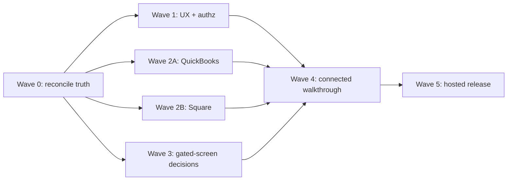

# MGR project remainder plan

## Outcome

Finish the non-Phase-1 remainder without reopening completed work: reconcile stale tracking, close current UX/security debt, land QuickBooks and Square safely, decide or defer the genuinely gated screens, prove connected workflows, then perform the ask-first hosted release.

## Current truth

- Program 10 is functionally complete: the 2026-09-10 audit found 133 ungated screens mapped and zero ungated screens without a live route.
- Program 15 landed on `main` in PR #303. Keep the no-LLM boundary; an LLM remains a separate, optional approval.
- QuickBooks exists on `qbo-lifecycle`, but the branch is far behind and highly divergent from `main`; audit and restack it before merge.
- Square has a small three-commit branch covering lifecycle and variation mapping; ingestion, menu availability, screens, docs, and validation remain.
- Issue #278 contains the real gated remainder: recipe/water schema decisions, cellar and keg views, portal schedule, and one repack tag conflict.
- Issues #304 and #305 are current user-facing regressions and should precede feature expansion.

## Dependency flow

## Wave 0 — reconcile before building

One tracking PR, no product behavior changes.

1. Re-run the screen-route/gate audit on current `main` and record the commit.
2. Remove completed Program 10 and Program 15 checklist entries from `TODO.md`; update the stale counts from source evidence.
3. Classify every unchecked spec-drift line as closed, owned by #278, or still actionable. Do not edit `.agents/PROGRESS.md`, `.agents/MEMORY.md`, or `.agents/DRIFT.md`.
4. For `qbo-lifecycle` and `square-pos`, record the minimal diff against current `main`, test status, conflicts, and exact remaining acceptance criteria. Preserve useful commits; do not merge either long-lived branch wholesale without this audit.

Exit: TODO matches current source and every remaining item has one owner and one issue/PR lane.

## Wave 1 — stabilize the base

These are independent, small PRs and can run in parallel.

### UX regressions

- #304: fix the shared `CommandForm`/sheet close path at its common owner; verify Close, Escape, overlay, and URL cleanup where applicable.
- #305: reproduce the sidebar width failure, fix the shared shell/sidebar state or CSS owner, and capture before/after phone and desktop screenshots.

### Authorization backlog

Land one focused PR per trust boundary, in severity order:

1. D2: revoke or gate direct execution of `lock_order` and `order_line_price`.
2. A1: impose a command-body size cap; add rate limiting only using existing platform capability. If no deploy-platform primitive is configured, document that release gate instead of inventing infrastructure.
3. A2: map expected Postgres constraint/permission errors to stable generic client messages while retaining server-side detail.
4. A3: add explicit RPC guards to `record_movement` and `set_taproom_par`.
5. A4: add the minimum security headers/CSP compatible with the current Next.js version, after reading its installed docs.
6. A5: make `seed-dev.ts` refuse non-local targets.

Exit: targeted regression test per fix, full relevant CI green, no broadened service-role access.

## Wave 2A — QuickBooks

Do not restart the feature. Recover the smallest reviewable sequence from `qbo-lifecycle`, rebased onto current `main`:

1. Durable outbound identity and push lifecycle: payload persisted before POST, stable idempotency key, serialized replay/finalization.
2. OAuth lifecycle: connect, refresh, reconnect, disconnect, health; tokens remain private and bound to the concrete connection.
3. Customer/item mapping plus invoice push and reconciliation.
4. Payments-back and late-bound portal Pay; never store the Pay URL.
5. Shared MGR screens, explorer ungating, customer docs, and rendered checks.

Required proof: no token leaks, no foreign-customer fetch, no duplicate push, atomic sync, zero/over-payment protection, and recovery after reconnect. Ted supplies sandbox credentials when this wave starts.

Exit: Program 13 acceptance passes on a fresh database and all QBO explorer screens are honestly ungated.

## Wave 2B — Square and menu

Build on the existing three-commit `square-pos` branch:

1. Rebase and validate lifecycle plus variation-level/location mapping already present.
2. Ingest raw Square sales without creating finished-goods movements; surface unknown variations.
3. Derive menu availability from mapped bin stock and format price.
4. Finish Point of sale, connection, locations, connector, Menu, POS item/mapping, and sale-detail screens through shared views.
5. Update staff docs, ungate records, and visually verify phone/desktop flows.

Required proof: one Square location per MGR location, mapped pours resolve to packaged stock, guest/unmapped items are safely ignorable, and empty stock cannot appear available. Ted supplies sandbox credentials when this wave starts.

Exit: Program 14 acceptance passes on a fresh database and the nine formerly gated POS screens are live.

## Wave 3 — gated screen remainder (#278)

Split #278 instead of treating it as one feature.

### Implement from existing domain truth

- Cellar addition/transfer: provide or retag the minimum shared `get_cellar_map` read needed by the live sheets.
- Keg report: add the named read/view only if Program 7 data already supplies the report faithfully.
- Repack: resolve the duplicate gate/tag conflict against the live command and shared view; do not add schema if the existing operation is sufficient.

### Product decision required

- Recipe process and water profiles: either approve the schema slice (mash, fermentation, water, additions, profiles) or explicitly defer all nine screens as post-launch.
- Portal Coming up: define the customer-visible schedule and RLS projection, or explicitly defer it.

No fixture may invent a SKU, ATP, unit, or barrel volume. A missing production fact remains gated.

Exit: each of the 12+ screens is either live with a shared view and command/query proof, or explicitly deferred with a named product decision.

## Wave 4 — adversarial connected walkthrough

Run after Waves 1–3 settle; this is proof, not another speculative feature program.

1. Generate the screen-to-scenario map from the current inventory.
2. Walk the ordering pilot first for each applicable persona on phone and desktop.
3. For each happy path, immediately test denial, invalid input, stale state, interruption/resume, and correction.
4. File only reproducible gaps with route/frame evidence; rank stock/money/auth failures before friction.
5. Separate launch blockers from deferred production, tap-board, recipe/water, and integration enhancements.

Exit: every in-scope screen is mapped, every high-priority scenario has evidence or an accepted decision, and all launch blockers are closed.

## Wave 5 — ask-first hosted release

Start only after Program 9 is merged and the walkthrough gate passes.

1. Obtain explicit approval, then provision hosted Supabase and run advisors.
2. Obtain explicit approval, then configure Vercel and environment values.
3. Add approved QuickBooks, Square, and Slack sandbox credentials; run required log pruning/scheduler setup before traffic where documented.
4. Run README login → catalog → inventory verification on the hosted project.
5. Require database-backed suites, typecheck, lint, build, and browser smoke tests to pass on the release revision.

Exit: hosted verification passes with no unresolved launch blocker; rollback/recovery steps and environment ownership are recorded in the release PR.

## Execution policy

- One concern per PR; use the exact `TODO:` directive when closing a checklist item.
- TDD business and security behavior; browser-check every UI change.
- Shared inventory/live view composition is mandatory for screen work.
- Re-estimate after each merged slice using actual implementation and CI time.
- Skip new abstractions, dependencies, LLM work, and speculative schema unless an acceptance criterion requires them.
